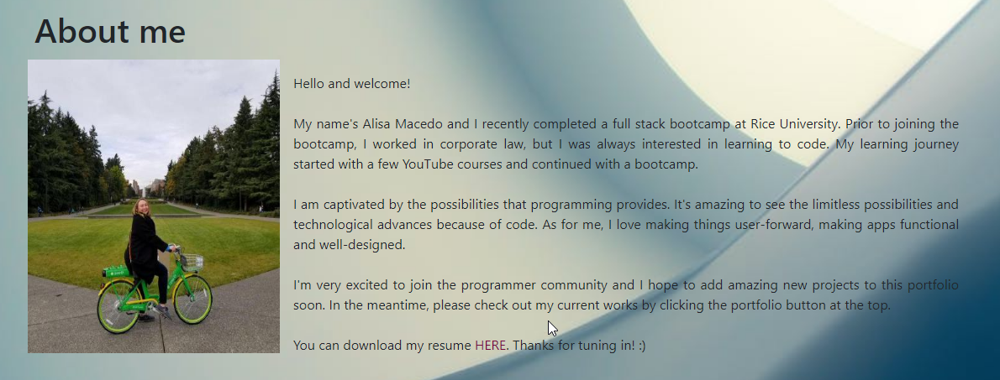
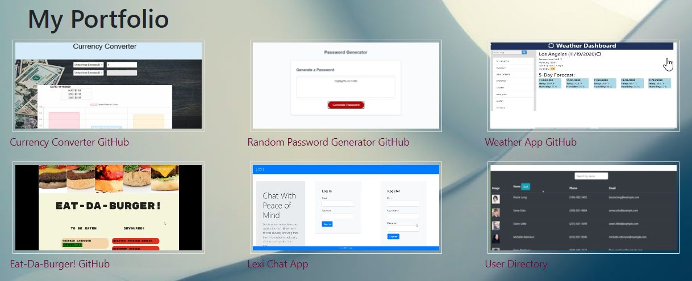

# Unit 02 CSS and Bootstrap Homework: Responsive Portfolio

This assignment is about designing a responsive website that works well on all trypes of screens.  Design ensures that web applications render well on a variety of devices and window or screen sizes. Below are the things I did to make this website using Bootstrap. In this assignment, I created a website that will host my work and has several distinctive sections: Main page - about me, Contact, Portfolio that will host my work, and a link to an external website.

## Work done
* Created a mobile-responsive portfolio with images to be added at a later date, with placeholders in the meantime.
* All pages- main, contact, and portfolio have a navigation pane thas't the same across the page
* I created Bootsrtap containers with a responsive layout to hold my information, uding About me, Contact, adn Portfolio
*The pages have working links to othe internal pages, as well as my LinkedIn and GitHub.
*All pages gave been checked on my mobile phone to ensure responsiveness.
*The images have been made responsive to screen change.

### Additional work done
*I udpated this portolio to include links to my GitHub, Heroku (Project 2), and resume
*Udpated portfolio page with images of work and links to deployed apps

##### images

